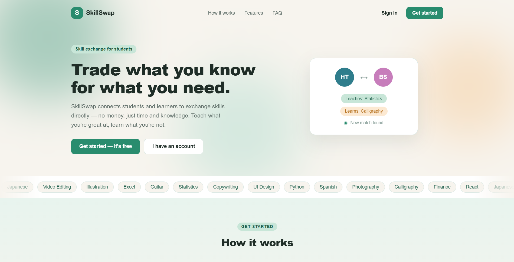

<div align="center">

# 🔄 SkillSwap

### Trade what you know for what you need.

A full-stack web app where students exchange skills directly — no money, just time and knowledge.

[](https://react.dev)
[](https://vitejs.dev)
[](https://supabase.com)
[](https://vercel.com)

[**🚀 Live Demo**](https://skill-swap-eight-eta.vercel.app) &nbsp;·&nbsp; [**🎨 Figma Design**](PASTE_YOUR_FIGMA_LINK_HERE) &nbsp;·&nbsp; [**🐛 Report a Bug**](https://github.com/Icession/SkillSwap/issues)

</div>

---

<!--
  📸 ADD A SCREENSHOT:
  1. Take a screenshot of your live landing page.
  2. Save it as  docs/screenshot.png  (create a "docs" folder in the repo root).
  3. Commit it — the image below will then render automatically.
-->


## Overview

**SkillSwap** is a peer-to-peer skill-exchange platform built for students and lifelong learners. Instead of paying for lessons, members trade skills directly: you teach what you're good at, and learn what you're not — all in one place.

List the skills you can offer and the ones you want to learn, browse and filter other members, send swap requests, and message each other to arrange a session. No payments, no subscriptions, ever.

This project was built as a full-stack portfolio piece, covering everything from authentication and a relational database with row-level security, to a custom-designed, animated frontend.

## ✨ Features

- 🔐 **Authentication** — email/password sign up and login with protected routes, powered by Supabase Auth.
- 👤 **Rich profiles** — offered and wanted skills, each with its own proficiency level, plus bio and availability.
- 🔍 **Discover feed** — browse members with live search and filters for category, level, and availability.
- 🤝 **Swap requests** — send, accept, decline, and complete skill exchanges between real users.
- 💬 **Messaging** — a private conversation thread tied to each swap request.
- 📊 **Personal dashboard** — track your active, pending, and completed swaps at a glance.
- ⚙️ **Editable settings** — update your profile and manage your skills anytime.
- 🛡️ **Row-Level Security** — database policies ensure users can only access their own swaps and messages.

## 🛠 Tech Stack

| Layer | Technology |
| --- | --- |
| **Frontend** | React 19, Vite, React Router |
| **Backend & Database** | Supabase (PostgreSQL, Auth, Row-Level Security) |
| **Styling** | Custom CSS design system |
| **Hosting** | Vercel |

## 🚀 Getting Started

### Prerequisites
- [Node.js](https://nodejs.org/) 18 or newer
- A free [Supabase](https://supabase.com/) project

### Installation

```bash
# 1. Clone the repository
git clone https://github.com/Icession/SkillSwap.git
cd SkillSwap

# 2. Install dependencies
npm install
```

### Environment variables

Create a `.env` file in the project root:

```env
VITE_SUPABASE_URL=your-supabase-project-url
VITE_SUPABASE_ANON_KEY=your-supabase-anon-key
```

> You'll find both values in your Supabase project under **Settings → API**.

### Database setup

1. In your Supabase project's **SQL Editor**, run the schema in [`supabase/schema.sql`](supabase/schema.sql), then the migration in [`supabase/migration.sql`](supabase/migration.sql).
2. Under **Authentication → Sign In / Providers → Email**, turn **Confirm email** *off* so accounts can sign in immediately.

### Run it

```bash
npm run dev
```

The app will be available at `http://localhost:5173`.

## 🗄 Database

The schema is fully relational with row-level security enabled on every table:

| Table | Purpose |
| --- | --- |
| `profiles` | User profile, offered/wanted skills, and availability |
| `swap_requests` | Skill-exchange requests between two users |
| `messages` | Conversation threads attached to a swap |
| `reviews` | Post-swap ratings (planned) |

Every policy is scoped to `auth.uid()`, so a user can only read and write their own data — requests and messages are visible only to their two participants.

## 📁 Project Structure

```
src/
├── components/   # Shared UI (Navbar, ProtectedRoute, RequestSwapModal)
├── context/      # AppContext — auth + data layer (talks to Supabase)
├── lib/          # Supabase client
├── pages/        # Landing, Feed, Profile, Dashboard, Messages, Settings, 404
│   └── auth/     # Login + 3-step registration flow
└── data/         # Skill -> category reference data
```

## 🧭 Roadmap

- [ ] Realtime updates via Supabase subscriptions (no refresh needed)
- [ ] Reviews and ratings after completed swaps
- [ ] In-app session scheduling
- [ ] Email notifications for new requests

## 👤 Author

**Icession**
- GitHub: [@Icession](https://github.com/Icession)

## 📄 License

This project is licensed under the [MIT License](LICENSE).

---

<div align="center">
<sub>Built with React, Vite, and Supabase.</sub>
</div>